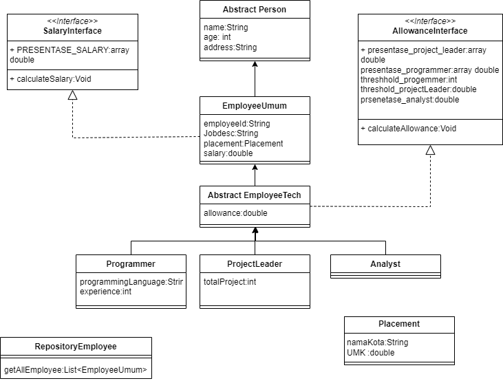

## Panduan dan Isi Repository

Repository ini berisi tentang penerapan OOP dan SOLID dengan penerapan case gaji karyawan sebagi contoh untuk tampilan main menunya:

```
=================================================================================
  ----- Selamat Datang di Aplikasi Pendataan karyawan PT. Secret Semut 79 -----

1. Add Employee
2. Edit employee
3. Data Employee
4. Data Payroll
5. Delete Employee
6. Searching
0. Exit

```

Tampilan dan isi datanya untuk employee sebagai berikut.

```
+--------------------------------------------------------------------------------+
| No    | Employee Id | Name       | Addrees    | Jobdesc              |Placement|
+--------------------------------------------------------------------------------+
| 1     | Emp-001    | Susi       | Bandung    | Admin                |Jakarta   |
+--------------------------------------------------------------------------------+
| 2     | Emp-002    | Anto       | Bandung    | Office Boy           |Bandung   |
+--------------------------------------------------------------------------------+
| 3     | Emp-003    | Riman      | Jakarta    | Human Resource Dev   |Bandung   |
+--------------------------------------------------------------------------------+
| 4     | Prog-001   | Budi       | Bandung    | Back End Dev         |Jakarta   |
+--------------------------------------------------------------------------------+
| 5     | Prog-002   | Ani        | Bandung    | Front End Dev        |Bandung   |
+--------------------------------------------------------------------------------+
| 6     | Prog-003   | UJang      | Jakarta    | Full Stack Dev       |Bandung   |
+--------------------------------------------------------------------------------+
| 7     | PL-001     | Ahmad      | Bandung    | Project Leader       |Garut     |
+--------------------------------------------------------------------------------+
| 8     | PL-002     | Dani       | Bandung    | Scrum Master         |Bekasi    |
+--------------------------------------------------------------------------------+
| 9     | PL-003     | Cecep      | Jakarta    | Project Owner        |Bogor     |
+--------------------------------------------------------------------------------+
| 10    | AL-001     | Indah      | Garut      | Analyst              |Jakarta   |
+--------------------------------------------------------------------------------+
| 11    | AL-002     | Puspa      | Bandung    | Analyst              |Bekasi    |
+--------------------------------------------------------------------------------+
| 12    | AL-003     | Sari       | Jakarta    | Analyst              |Bogor     |
+--------------------------------------------------------------------------------+
| 0     | Kembali Ke Main Menu                                                   |
+--------------------------------------------------------------------------------+

```

### Struktur kelas

Struktur Kelas yang digunakan bisa dilihat dari diagram berikut.


